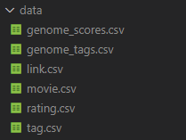

## Eksloracja danych - przykładowy problem 1

### Przygotowanie środowiska

 1. Sklonuj to repozytorium do lokalnego folderu
 2. Pobierz zbiór danych ze strony https://www.kaggle.com/datasets/grouplens/movielens-20m-dataset?resource=download 
 3. Utwórz w lokalnym folderze folder data/
 4. Przekopiuj do folderu data/ pliki 

    

### Zadanie

 1. Zapoznaj się z notatnikiem judge.ipynb
 2. W katalogu src/ znajdziesz plik system111333.py. Zmodyfikuj go tak, aby nazwa zawierała twój numer indeksu. W treści tego pliku powinna znajdować się implementacja twojego systemu oceniającego.
 3. Umieść rozwiązanie w katalogu, do którego dostęp znajdziesz na stronie kursu (tylko plik z systemem).

### Wyniki
Final

| Lp.  |  Nazwa |	Score |	RMSE |	MAE |

| --- | --- | --- | --- | --- | --- |   

| 1  |   SVD Recommender System by 151756 |	3482 | 0,705648014	| 0,541605368 |
| 2  | 151481 |	1718 | 0,887824422	| 0,689527736 |
| 3  | System created by 151778 |	1101 | 0,891739717	| 0,689321703 |
| 4  | System created by 151561 |	1302 | 0,893357119	| 0,692696798 |
| 5  | MySystem (152043) |	1103 | 0,899444365	| 0,689839333 |
| 6  | System created by 151885 |	1304 | 0,901790813	| 0,690785708 |
| 7  | System created by 151739 |	1064 | 0,910697106	| 0,69697402 |
| 8  | System created by 151850 |	855 | 0,913183688	| 0,698323648 |
| 9  | MyPearsonAdjusted (151851) |	1193 | 0,913495283	| 0,698256814 |
| 10 | MySystem (151833) |	383 | 0,914458703	| 0,717984702 |
| 11 | System created by 151754 |	447 | 0,916352419	| 0,702271907 |
| 12 | System created by 152809 |	84 | 0,921198907	| 0,724721829 |
| 13 | System created by 147715 |	490 | 0,931857069	| 0,72012413 |
| 14 | Bestia Tytan Ostateczny (151861) |	77 | 0,933047038	| 0,734313502 |
| 15 | System created by 151835 |	742 | 0,937720472	| 0,724254567 |
| 16 | System created by 152040 |	138 | 0,938102663	| 0,740257397 |
| 17 | System created by 151118	 |-84 | 0,940136984	| 0,742104353 |
| 18 | System created by 151129	 |-334 | 0,94215491	| 0,741872383 |
| 19 | Genre Average Weighted Rating (151774)	 |-74 | 0,943000097	| 0,740290585 |
| 20 | System created by 151061 |	1047 | 0,94434456	| 0,714875 |
| 21 | System created by 151504	 |-278 | 0,946284556	| 0,745495713 |
| 22 | System created by 153029 |	108 | 0,946854236	| 0,7415376 |
| 23 | System created by 151867 |	637 | 0,948335696	| 0,730897598 |
| 24 | Similarity + Genre Boosted System 151895 |	250 | 0,953017096	| 0,73965464 |
| 25 | System created by 151868	 |-308 | 0,977434235	| 0,763257528 |
| 26 | Average Movie Rating	 |-398 | 0,98818404	| 0,774281362 |
| 27 | Average User Rating	 |-440 | 0,995360168	| 0,778704223 |
| 28 | Average Global Movie Rating	 |-2166 | 1,061607676	| 0,864185842 |
| 29 | Naive Rating	 |-4207 | 1,54616903	| 1,351416667 |
| 30 | Cheater	 |-4181 | 1,553784164	| 1,359842593 |
| 31 | System created by 111333	 |-4266 | 1,558715473	| 1,36512037 |

Split 1: 
1. SVD Recommender System by 151756, 1098 pkt, RMSE: 0.710, MAE: 0.544
2. 151481, 546 pkt, RMSE: 0.889, MAE: 0.691
3. System created by 151885, 514 pkt, RMSE: 0.899, MAE: 0.688
4. System created by 151561, 434 pkt, RMSE: 0.897, MAE: 0.695
5. System created by 151739, 389 pkt, RMSE: 0.908, MAE: 0.693
6. System created by 151778, 373 pkt, RMSE: 0.884, MAE: 0.684
7. MySystem (152043), 361 pkt, RMSE: 0.897, MAE: 0.688
8. MyPearsonAdjusted (151851), 351 pkt, RMSE: 0.919, MAE: 0.703
9. System created by 151061, 332 pkt, RMSE: 0.938, MAE: 0.710
10. System created by 151850, 272 pkt, RMSE: 0.909, MAE: 0.696
11. System created by 151867, 233 pkt, RMSE: 0.949, MAE: 0.732
12. System created by 151754, 204 pkt, RMSE: 0.914, MAE: 0.699
13. System created by 147715, 202 pkt, RMSE: 0.933, MAE: 0.720
14. MySystem (151833), 176 pkt, RMSE: 0.909, MAE: 0.714
15. System created by 151835, 164 pkt, RMSE: 0.945, MAE: 0.727
16. System created by 152040, 110 pkt, RMSE: 0.930, MAE: 0.734
17. Similarity + Genre Boosted System 151895, 62 pkt, RMSE: 0.959, MAE: 0.746
18. Bestia Tytan Ostateczny (151861), 51 pkt, RMSE: 0.934, MAE: 0.736
19. System created by 153029, 34 pkt, RMSE: 0.951, MAE: 0.742
20. Genre Average Weighted Rating (151774), 4 pkt, RMSE: 0.942, MAE: 0.741
21. System created by 152809, -1 pkt, RMSE: 0.918, MAE: 0.724
22. System created by 151118, -9 pkt, RMSE: 0.947, MAE: 0.748
23. System created by 151868, -105 pkt, RMSE: 0.973, MAE: 0.761
24. System created by 151129, -112 pkt, RMSE: 0.941, MAE: 0.740
25. System created by 151504, -128 pkt, RMSE: 0.950, MAE: 0.746
26. Average User Rating, -180 pkt, RMSE: 0.992, MAE: 0.778
27. Average Movie Rating, -200 pkt, RMSE: 0.990, MAE: 0.775
28. Average Global Movie Rating, -584 pkt, RMSE: 1.060, MAE: 0.863
29. Naive Rating, -1342 pkt, RMSE: 1.539, MAE: 1.344
30. Cheater, -1452 pkt, RMSE: 1.561, MAE: 1.369
31. System created by 111333, -1487 pkt, RMSE: 1.563, MAE: 1.371

Split 2:
1. SVD Recommender System by 151756, 1180 pkt, RMSE: 0.7028007056974699, MAE: 0.5403587816557505
2. 151481, 612 pkt, RMSE: 0.8858948947539722, MAE: 0.6878408209740584
3. MyPearsonAdjusted (151851), 484 pkt, RMSE: 0.9130315186033555, MAE: 0.6976502985132425
4. System created by 151561, 474 pkt, RMSE: 0.8927246524862644, MAE: 0.6926382155541781
5. MySystem (152043), 412 pkt, RMSE: 0.8977610106426077, MAE: 0.6877157867114337
6. System created by 151739, 384 pkt, RMSE: 0.9093107005739127, MAE: 0.6972641027862119
7. System created by 151778, 318 pkt, RMSE: 0.8936436182304371, MAE: 0.6910011057203301
8. System created by 151885, 307 pkt, RMSE: 0.9044449125215687, MAE: 0.6937031276378293
9. System created by 151850, 266 pkt, RMSE: 0.9159736165195775, MAE: 0.700295835824343
10. System created by 151061, 255 pkt, RMSE: 0.9488466134383013, MAE: 0.7179791666666666
11. System created by 151835, 242 pkt, RMSE: 0.9351363327782921, MAE: 0.7237296903507447
12. System created by 151867, 155 pkt, RMSE: 0.9443050179767357, MAE: 0.7279474464234726
13. System created by 147715, 116 pkt, RMSE: 0.9336599520072683, MAE: 0.721689307859766
14. MySystem (151833), 83 pkt, RMSE: 0.9183152072120137, MAE: 0.7202891845334904
15. System created by 151754, 82 pkt, RMSE: 0.9198753712611072, MAE: 0.7052215320703937
16. Bestia Tytan Ostateczny (151861), 54 pkt, RMSE: 0.9345549817263535, MAE: 0.7342367599933988
17. System created by 152809, 46 pkt, RMSE: 0.9216524280066299, MAE: 0.7239801354263327
18. Similarity + Genre Boosted System 151895, 42 pkt, RMSE: 0.9534531920855787, MAE: 0.7388873241159168
19. System created by 153029, 36 pkt, RMSE: 0.947364095043298, MAE: 0.7437507631402217
20. System created by 152040, -2 pkt, RMSE: 0.9453689256893, MAE: 0.7458150763932089
21. System created by 151504, -28 pkt, RMSE: 0.9436954166822997, MAE: 0.7448266184687115
22. System created by 151118, -33 pkt, RMSE: 0.9393214443869647, MAE: 0.7410254814112175
23. Genre Average Weighted Rating (151774), -44 pkt, RMSE: 0.9442681680245125, MAE: 0.7405414083734567
24. Average Movie Rating, -48 pkt, RMSE: 0.9848980846254357, MAE: 0.7724318472426618
25. System created by 151868, -78 pkt, RMSE: 0.9801722956451644, MAE: 0.7653926539894513
26. System created by 151129, -130 pkt, RMSE: 0.9441537122078159, MAE: 0.744325471558569
27. Average User Rating, -133 pkt, RMSE: 0.9994018339541221, MAE: 0.7826043151531922
28. Average Global Movie Rating, -766 pkt, RMSE: 1.0617141706003985, MAE: 0.8639892240457858
29. Cheater, -1362 pkt, RMSE: 1.5516657715715285, MAE: 1.3563333333333334
30. Naive Rating, -1405 pkt, RMSE: 1.55, MAE: 1.3550833333333334
31. System created by 111333, -1407 pkt, RMSE: 1.5584313694652496, MAE: 1.3639166666666667

Split 3
1. SVD Recommender System by 151756, 1204 pkt, RMSE: 0.7041433353288434, MAE: 0.5404573224535104
2. 151481, 560 pkt, RMSE: 0.8885783712157601, MAE: 0.6897423859871535
3. System created by 151885, 483 pkt, RMSE: 0.9019275256213449, MAE: 0.690653995165083
4. System created by 151061, 460 pkt, RMSE: 0.9461870667461999, MAE: 0.7166458333333333
5. System created by 151778, 410 pkt, RMSE: 0.89757553180403, MAE: 0.6929640030107924
6. System created by 151561, 394 pkt, RMSE: 0.890346705334313, MAE: 0.6904521791266931
7. MyPearsonAdjusted (151851), 358 pkt, RMSE: 0.908454329748443, MAE: 0.694120143525307
8. System created by 151835, 336 pkt, RMSE: 0.933025083109764, MAE: 0.7220340115137165
9. MySystem (152043), 330 pkt, RMSE: 0.9035720853741556, MAE: 0.6938022111690524
10. System created by 151850, 317 pkt, RMSE: 0.9145774479477725, MAE: 0.6986751068704314
11. System created by 151739, 291 pkt, RMSE: 0.9147806171241272, MAE: 0.7006579566704928
12. System created by 151867, 249 pkt, RMSE: 0.9517020690865341, MAE: 0.7327453468312655
13. System created by 147715, 172 pkt, RMSE: 0.9289112539719833, MAE: 0.7186830814206563
14. System created by 151754, 161 pkt, RMSE: 0.9151818855851674, MAE: 0.7025941892695867
15. Similarity + Genre Boosted System 151895, 146 pkt, RMSE: 0.9465980944945079, MAE: 0.7340765951483506
16. MySystem (151833), 124 pkt, RMSE: 0.9160609025731251, MAE: 0.7196649226788658
17. System created by 152809, 39 pkt, RMSE: 0.9239442939634537, MAE: 0.7261853530539926
18. System created by 153029, 38 pkt, RMSE: 0.9421986118499056, MAE: 0.7388620366030259
19. System created by 152040, 30 pkt, RMSE: 0.9389390636589059, MAE: 0.7409571160126769
20. Bestia Tytan Ostateczny (151861), -28 pkt, RMSE: 0.9305861324273944, MAE: 0.7327037449243751
21. Genre Average Weighted Rating (151774), -34 pkt, RMSE: 0.9427321236971682, MAE: 0.7393303467476482
22. System created by 151118, -42 pkt, RMSE: 0.9340895090632962, MAE: 0.737287576183287
23. System created by 151129, -92 pkt, RMSE: 0.9413110171575452, MAE: 0.7412916787439334
24. System created by 151504, -122 pkt, RMSE: 0.945158252333074, MAE: 0.7456605190494939
25. System created by 151868, -125 pkt, RMSE: 0.9791304104575052, MAE: 0.7633799285970873
26. Average User Rating, -127 pkt, RMSE: 0.9946786708611166, MAE: 0.7755083532103373
27. Average Movie Rating, -150 pkt, RMSE: 0.9896540345575495, MAE: 0.7754122388401369
28. Average Global Movie Rating, -816 pkt, RMSE: 1.0631088579352885, MAE: 0.8655683030972906
29. Cheater, -1367 pkt, RMSE: 1.5486867196291043, MAE: 1.3541944444444445
30. System created by 111333, -1372 pkt, RMSE: 1.5547150507050767, MAE: 1.3604444444444443
31. Naive Rating, -1460 pkt, RMSE: 1.5495070900845282, MAE: 1.3551666666666666