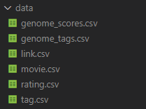

## Eksloracja danych - przykładowy problem 1

### Przygotowanie środowiska

 1. Wykonaj 'fork' tego repozytorium.
 2. Sklonuj fork do lokalnego folderu
 3. Pobierz zbiór danych ze strony https://www.kaggle.com/datasets/grouplens/movielens-20m-dataset?resource=download 
 4. Utwórz w lokalnym folderze folder data/ (katalog data/ powinien być w .gitignore)
 5. Przekopiuj do folderu data/ pliki 


    

### Zadanie

 1. Zapoznaj się z notatnikiem judge.ipynb
 2. Utwórz roboczy branch
 3. W katalogu src/ znajdziesz plik system111333.py. Zmodyfikuj go tak, aby nazwa zawierała numer indeksu jednego z uczestników grupy projektowej. W treści tego pliku powinna znajdować się implementacja twojego systemu oceniającego.
 4. Rozwiąż zadanie
    - Przygotuj pod-zadania dotyczące tego problemu na tablicy Kanban
    - Zaplanuj daty wykonania zadań
    - Przydziel zadania członkom zespołu
    - Zaplanuj dwie iteracje
    - Termin spotkania dotyczącego mini-projektu: 17.03.2026
 5. Umieść rozwiązanie w katalogu, do którego dostęp znajdziesz na stronie kursu (tylko plik z systemem).

Termin wykonania zadania: 31.03.2026

### Rozwiązania

Aby uruchomić konkurs należy w pierwszej kolejności uzupełnić dane modeli dostarczonych przez systemy. Skopiuj do swojej lokalnej kopii repozytorium modele umieszczone w tym katalogu:
https://drive.google.com/drive/folders/1k6kbKGJ2jYi91T5Yy4MnEy7ijDDWNdx8?usp=drive_link

1. Utwórz środowisko wirtualne 
   ```python -m venv ven```
2. Zainstaluj biblioteki w odpowiednich wersjach
   ```pip install -r reqiurements.txt```
3. Uruchom konkurs
   ```python src/run.py```

Domyślnie konkurs obejmuje 10 przebiegów dla wszystkich dostarczonych systemów. Jedno uruchomienie trwa bardzo długo (kilka godzin). Możesz zmniejszyć ten czas komentując rejestrację wybranych systemów.

```
    #print('registering System156962...')
    #start = time()
    #competition.register(System156962())
    #end = time()
    #systems.append('System156962')
    #times.append(end - start)
```

Opcjonalnie możesz zmniejszyć liczbę iteracji.

```
   for i in range(10):
        start = time()
        print('--------------------------------------------------------')
        print(f'Building round robin schedule: iteration {i+1}/10')
        competition.build_round_robin()
        #run the competition - it prints out the results
        print(f'results after round robin {i+1}/10:')
        competition.compete()
        end = time()
        print(f'Round robin {i+1} completed in {end - start:.2f} seconds')
```


 ### Wyniki

Średnia wyznaczona na podstawie 10 przebiegów.

| Lp. | System | Średnia punktacja | RMSE | MAE | Ocena |
| :--- | :--- | :--- | :--- | :--- | :--- |
| 1 | System 155294 and 155877 (with anti-cheat filtering) | 1520 | 0.819553 | 0.56 | 25 pkt |
| 2 | System created by 155898 and 156021 and 155934 | 928 | 0.834166 | 0.621667 | 22.5 pkt |
| 3 | System created by 155198 and 155921 | 776 | 0.801428 | 0.620681 | 20 pkt |
| 4 | System created by 155864 155916 | 644.5 | 0.799451 | 0.621554 | 17.5 pkt |
| 5 | System created by 158058 and 155077 | 639 | 0.85049 | 0.643333 | 17.5 pkt |
| 6 | System created by 156962 and 155994 | 494 | 0.819666 | 0.633991 | 17.5 pkt |
| 7 | System created by 155937 155835 and 156014 | 343 | 0.842836 | 0.64018 | 17.5 pkt |
| 8 | System created by 155987 and 155976 | 231.5 | 0.840293 | 0.662313 | 17.5 pkt |
| 9 | System created by 156007 and 155833 | 203.5 | 0.855831 | 0.656075 | 17.5 pkt |
| 10 | System created by 155093 | 190.5 | 0.850545 | 0.652165 | 17.5 pkt |
| 11 | SVD++ 156145_155941_155260 (CV-Ready) | 182 | 0.848488 | 0.664656 | 17.5 pkt |
| 12 | System created by 155974 155874 and 155879 | 79 | 0.874786 | 0.676856 | 17.5 pkt |
| 13 | System created by 155922 and 155944 | -395 | 0.87601 | 0.694529 | 17.5 pkt |
| 14 | System created by 156027 and 155829 | -424 | 0.899228 | 0.711614 | 17.5 pkt |


Czas przetwarzania: 7 dni 11 godzin 23 minuty 17 sekund
